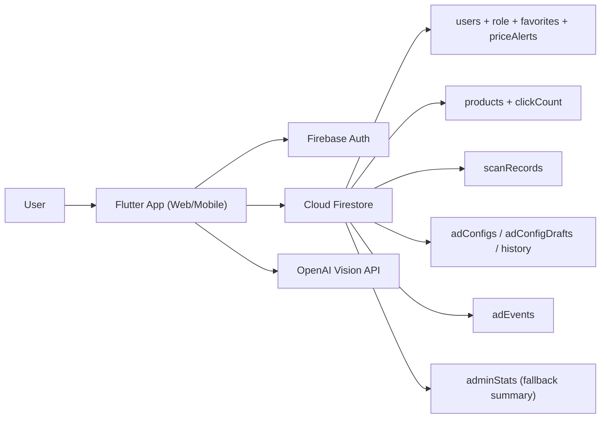

# SharpFace System Design Review (EN + 繁中)

## 0) Scope / 範圍

### English
This review covers the current Flutter + Firebase architecture in this repository, with focus on:
- system architecture and tradeoffs
- data structure choices and alternatives
- scalability, security, and operability implications
- deep-dive interview questions and prepared answers

### 繁體中文
本文件審查目前此專案的 Flutter + Firebase 架構，重點包含：
- 系統架構與取捨
- 資料結構選型與替代方案
- 可擴充性、安全性、可維運性影響
- 深入追問（deep dive）題庫與答題準備

---

## 1) Architecture Summary / 架構總覽

### English
Current architecture is **client-centric**:
- Frontend: Flutter (Web-first, also supports mobile/desktop)
- State: Riverpod (`productProvider`) + local widget state
- Backend: Firebase Auth + Firestore
- AI analysis: OpenAI Vision API called from app service layer
- Caching: SharedPreferences-based TTL cache (`LocalCacheService`)
- Monetization modules: affiliate links, ad pools, featured ranking, favorites, price alerts

This design optimizes for fast iteration and low ops overhead (especially under Spark plan constraints), at the cost of stronger server-side control and trust boundaries.

### 繁體中文
目前架構屬於 **前端主導（client-centric）**：
- 前端：Flutter（以 Web 為主，也支援 mobile/desktop）
- 狀態管理：Riverpod（`productProvider`）+ 畫面本地 state
- 後端：Firebase Auth + Firestore
- AI 分析：由 App service 層呼叫 OpenAI Vision API
- 快取：`LocalCacheService`（SharedPreferences + TTL）
- 商業模組：聯盟導購、廣告池、贊助置頂、最愛、降價通知

此設計優勢是迭代快、維運成本低（特別符合 Spark plan），代價是後端治理能力與信任邊界較弱。

---

## 2) High-Level Component Diagram / 高階元件圖

---

## 3) Runtime Flows / 核心流程

### 3.1 Skin Analysis Flow / 膚質分析流程

### English
1. User picks image.
2. Guest must pass phone OTP once (if not logged in).
3. App sends image bytes to OpenAI service (`OpenAIService`).
4. Parse strict JSON result (`skinType`, `suggestion`, `concerns`).
5. Save scan record to Firestore (`scanRecords`).
6. Update UI recommendation + ad pool selection by concerns.

### 繁體中文
1. 使用者選擇照片。
2. 未登入者需先完成一次手機 OTP 驗證。
3. App 透過 `OpenAIService` 送圖到 OpenAI。
4. 解析嚴格 JSON 結果（`skinType`、`suggestion`、`concerns`）。
5. 寫入 Firestore `scanRecords`。
6. 依 concerns 更新保養建議與廣告池內容。

### Tradeoff / 取捨
- Pro: simple and fast delivery.
- Con: API call from client has stronger key exposure risk on web.

---

### 3.2 Favorites & Product Flow / 商品與最愛流程

### English
1. Product list from Firestore via `ProductRepository`.
2. `ProductProvider` sorts: featured first, then rating; limit 10.
3. Logged-in favorites sync from `users/{uid}/favorites`.
4. Local cache (TTL 10 mins) reduces redundant reads.

### 繁體中文
1. 商品列表由 `ProductRepository` 從 Firestore 讀取。
2. `ProductProvider` 排序規則：`isFeatured` 先、再按評級；最多 10 筆。
3. 登入後最愛資料同步於 `users/{uid}/favorites`。
4. 透過 10 分鐘 TTL 快取降低重複讀取成本。

### Tradeoff / 取捨
- Pro: cross-device consistency + low complexity.
- Con: favorites duplicate product snapshot fields; may drift from product canonical data.

---

### 3.3 Ads Flow / 廣告流程

### English
1. App subscribes to ad pools (`adConfigs`) by concern category.
2. Admin edits draft (`adConfigDrafts`) and publishes to live with history.
3. Impression/click events are append-only writes to `adEvents`.
4. Dashboard computes top CTR from recent event window.

### 繁體中文
1. App 依 concern 分類訂閱 `adConfigs` 廣告池。
2. 管理員先改 `adConfigDrafts`，發布到正式配置並留存歷史版本。
3. 曝光/點擊採事件上報，寫入 `adEvents`（append-only）。
4. 後台以近期事件計算最高 CTR。

### Tradeoff / 取捨
- Pro: immutable event logging is audit-friendly and extensible.
- Con: client-side aggregation cost grows with event volume; hard cap (`limit 1000`) is eventually inaccurate at scale.

---

## 4) Data Structure Choices, Why, and Alternatives / 資料結構選型、原因與替代方案

## 4.1 `users/{uid}` + role field

### Why this choice / 為何選這種
- Role check is straightforward for Firestore rules.
- Registration bootstrap (`role: user`) is easy to enforce.

### Alternatives / 替代方案
- Custom claims (Auth token) as primary role source.
- Dedicated `roles/{uid}` collection.

### Tradeoff / 取捨
- Current: simple, readable rules; but every admin check may read user doc.
- Claims: faster auth checks, but requires privileged claim management pipeline.

---

## 4.2 `users/{uid}/favorites/{productId}` as subcollection

### Why this choice / 為何選這種
- Natural per-user partitioning.
- Easy security boundary (`request.auth.uid == userId`).
- Cross-device sync with low query complexity.

### Alternatives / 替代方案
- Store favorites as array in `users` document.
- Keep favorites only locally (no cloud sync).

### Tradeoff / 取捨
- Subcollection scales better than arrays and avoids doc size limits.
- Snapshot duplication inside favorite docs can become stale when product changes.

---

## 4.3 `products` flat collection + `isFeatured`, `clickCount`

### Why this choice / 為何選這種
- Simple listing and ranking fields.
- Atomic click increment via `FieldValue.increment(1)`.

### Alternatives / 替代方案
- Separate ranking collection/materialized views.
- Split catalogs by category subcollections.

### Tradeoff / 取捨
- Flat model is easy now.
- For larger catalog/search needs, dedicated search index (Algolia/Meilisearch/Elastic) becomes preferable.

---

## 4.4 `scanRecords` append-only event records

### Why this choice / 為何選這種
- Preserves history and trend reconstruction.
- Supports historical charts and future analytics.

### Alternatives / 替代方案
- Store only latest scan per user.
- Time-bucketed aggregates only.

### Tradeoff / 取捨
- Append-only gives flexibility and auditability.
- Requires lifecycle/retention policy to control storage and privacy risk.

---

## 4.5 `adConfigs` + `adConfigDrafts` + `history`

### Why this choice / 為何選這種
- Supports preview/draft/publish/rollback in pure Firestore.
- No Cloud Functions dependency required.

### Alternatives / 替代方案
- Single document with version field only.
- External CMS for ad operations.

### Tradeoff / 取捨
- Current approach is practical for Spark plan.
- Manual publish workflows can produce race conditions without stronger locking/version checks.

---

## 4.6 `adEvents` event log, `adStats` read-only aggregated target

### Why this choice / 為何選這種
- Immutable events are better for anti-tamper and reprocessing.
- Keeps future path open for backend aggregation.

### Alternatives / 替代方案
- Directly increment `adStats` counters from clients.
- Compute all stats on-read every time.

### Tradeoff / 取捨
- Event-first is safer than direct counters.
- Without backend aggregator, dashboard analytics remain approximate and costlier.

---

## 4.7 Local TTL cache (`SharedPreferences` JSON blobs)

### Why this choice / 為何選這種
- Zero infra overhead.
- Good enough for small payloads (favorites/ad configs/recent views).

### Alternatives / 替代方案
- Hive/Isar local DB with indexed queries.
- Memory-only cache with no persistence.

### Tradeoff / 取捨
- SharedPreferences is simple but not ideal for large structured datasets or partial updates.

---

## 5) Architecture Tradeoff Matrix / 架構取捨矩陣

| Decision | Benefit | Cost/Risk | When to Upgrade |
|---|---|---|---|
| Client-centric orchestration | Fast iteration, low ops | Weaker trust boundary | Add backend/API gateway when traffic/security grows |
| Firestore as primary store | Managed, scalable enough | Query/index constraints, cost spikes on hot listeners | Add query shaping + cache + selective denormalization |
| Event logging for ads | Auditability, re-aggregation path | Read-time compute overhead | Move to scheduled/backend aggregation |
| Subcollection per user data | Good auth isolation | More document fan-out | Keep; add retention + archival policy |
| TTL cache only | Cheap cost reduction | Stale data windows | Add ETag/version-aware delta sync |

---

## 6) Security and Reliability Notes / 安全與可靠性重點

### English
- Firestore rules are structurally strong on RBAC boundaries.
- Positive: `adStats` immutable from clients; role escalation blocked in user update rules.
- Key risk: web client calling OpenAI directly can expose key at runtime/build artifacts.
- Guest verification audit currently allows open creates in `guestVerifications`; acceptable for telemetry but can be spammed unless rate-controlled externally.

### 繁體中文
- Firestore 規則在 RBAC 邊界上整體合理。
- 優點：`adStats` 不允許客戶端改寫；使用者無法自行改 `role`。
- 關鍵風險：Web 客戶端直連 OpenAI，API Key 暴露風險高。
- `guestVerifications` 目前允許公開 create，作為稽核資料可行，但若無額外節流機制容易被灌水。

### Low-risk hardening now (no Cloud Functions) / 目前可做的低風險強化（不依賴 Cloud Functions）
- tighten `guestVerifications` schema validation in rules (field whitelist, length caps)
- enforce stricter constraints on `scanRecords` optional fields (`contact` length/pattern)
- add app-level client rate limits/backoff for OTP and scan attempts
- rotate OpenAI key frequently and keep environment segregation (dev/stage/prod keys)

---

## 7) Deep-Dive Questions & Prepared Answers / 深入追問題庫與答題準備

## Q1. Why Firestore over SQL?
- EN: Firestore aligns with app-shaped documents, real-time streams, and low-ops constraints. SQL is better for complex joins/reporting, but current product velocity and team size favor Firestore.
- ZH: Firestore 適合文件型資料與即時串流，且維運成本低。SQL 在複雜關聯與報表更強，但以目前產品階段與團隊規模，Firestore 更務實。

## Q2. Why duplicate product fields in favorites?
- EN: It keeps favorite cards renderable even when product list fetch is delayed and supports cache-first UX. Tradeoff is staleness; app should reconcile with canonical product data when available.
- ZH: 複製商品欄位可讓最愛清單即時渲染、離線/弱網也有內容。代價是可能與主商品資料不同步，需在主資料可用時做對齊。

## Q3. Why event log for ads instead of direct counters?
- EN: Direct counters are simpler but easier to game and harder to audit. Event logs preserve provenance and allow re-computation.
- ZH: 直接計數雖簡單，但較容易被灌水且難追查。事件流保留來源，可重算、可稽核。

## Q4. Biggest scale bottleneck?
- EN: Client-side aggregate on `adEvents` and broad listeners at higher traffic. Move to backend aggregation/materialized summaries when event volume rises.
- ZH: 高流量下最大瓶頸是 `adEvents` 客戶端聚合與多監聽成本。事件量上來後應改為後端彙總或物化統計。

## Q5. How do you guarantee admin-only actions?
- EN: Double gate: UI visibility by `isAdmin` plus Firestore rule enforcement (`isAdmin()` checks user role doc).
- ZH: 雙層控管：前端 UI 隱藏 + Firestore rules 強制驗證 `isAdmin()`。

## Q6. What is the main security gap today?
- EN: Calling OpenAI from web client with API key. Long-term fix is server-side proxy/token-minting.
- ZH: 最大缺口是 Web 端直呼 OpenAI 導致 key 暴露風險。長期需改為伺服器代理或短期權杖機制。

## Q7. Why not use Cloud Functions now?
- EN: Cost/plan constraint (Spark) and faster iteration. Design intentionally keeps event schema compatible with future backend aggregation.
- ZH: 受 Spark 方案與成本限制，先採低維運方案，同時保留未來後端聚合的相容資料結構。

## Q8. How would you migrate with minimal risk?
- EN: Introduce backend aggregation first (read-only), keep existing writes, dual-read compare, then switch dashboard source.
- ZH: 先上後端聚合（唯讀），保留現行寫入，雙讀比對後再切換後台讀源，降低風險。

---

## 8) Suggested Next Architecture Steps / 建議下一步架構演進

### Phase A (now, low risk)
- strengthen Firestore schema guards on open-write collections
- add explicit index plan documentation for all production queries
- add retention policy for `scanRecords` and `adEvents`

### Phase B (when traffic increases)
- move OpenAI call behind backend proxy
- move ad CTR aggregation to backend batch job
- introduce stronger observability: event ids, trace correlation, error budgets

### Phase C (scale and growth)
- add search index service for product discoverability
- split read models for admin analytics vs user-facing serving path
- evaluate multi-environment deployment governance and secret rotation automation

---

## 9) Review Conclusion / 審查結論

### English
The current design is coherent for v0.1/v1 goals: quick delivery, manageable complexity, and monetization-ready flows.  
The main tradeoff is security/analytics maturity due to client-centric execution and no backend aggregation layer.

### 繁體中文
目前設計對 v0.1/v1 目標是合理且一致的：交付快、複雜度可控、商業流程可運作。  
主要代價在於安全與分析成熟度，因為目前仍以前端主導、缺少後端聚合層。

